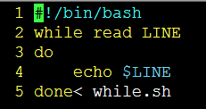
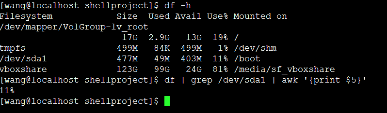
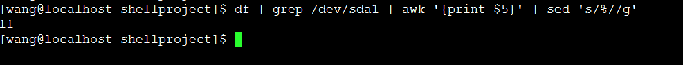

# shell脚本

### 1.shell基础
查看系统的shell ： cat  /etc/shells
显示系统当前正在系统的shell：echo   $SHELL
改变你的当前运行的shell:   /bin/ksh  就会切换成   ksh，   exit就会直接退回到上一个shell
修改文件的用户组和用户(在root用户下进行)： chown  wang.wang  abc1.c(将abc.1的用户和用户组修改为wang  和  wang)
>为什么创建文件默认权限是644?

>为什么创建默认权限是755？

这就是掩码在作怪：
如果掩码是022，那么你创建目录的默认权限是755（rwxr-xr-x），（0+7=7,   2+5=7， 2+5=7）

### 2.shell中的位置变量
```
#！/bin/bash
echo "脚本的名字：$0" 表示命令行第0个参数
echo "parm 1:$1"   表示第1个参数
echo "参数的个数：$#"
echo "所有的参数： $*"
echo "上一条命令的运行状态：$?"
```

### 3.控制流
test  conditon  或者  [ condition ]

-d 表示检测是不是一个目录

-s  表示成都大与0，非空

-w  测试这个文件是不是可写

-L   判断是不是符号链接符

-u   文件有suid为设置

-r   是否可读

-x   是否可执行

```
#!/bin/bash
test -d mulu   测试“mulu ”这个文件是否正确（0表示正确，1表示错误）
echo $?   表示上一个命令输出的结果
```

```
#!/bin/bash
echo -n "enter a number from 1 to 3"
read num
case $num in
1）
    echo "you  select 1"
    ;;
2)
    echo "you select 2"
    ;;
esac
```

>* for循环

```
#!/bin/bash
for loop in `cat myfile`
do
    echo $i
done
打印文件按照  行+空格为一行
```

>* while循环.按照行读取文件(注意文件名写在下面那)




### 4.demo
* awk按列找



* sed  's/old/new/g'   (sed表示替换，将old替换成new,  g表示全部替换)


