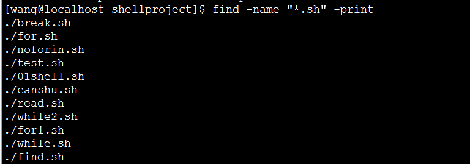
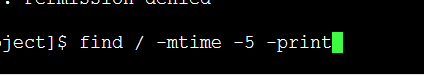
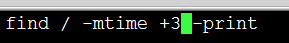
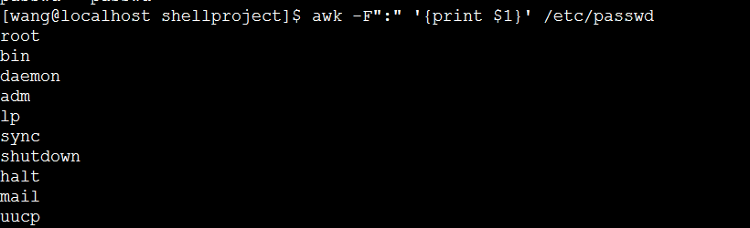
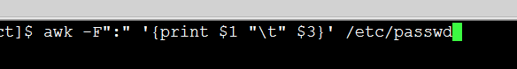
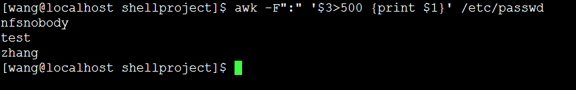

# shell脚本文本过滤

### 1.正则表达式
```
^    只匹配行首
$     只匹配行尾
*     一个单字符紧跟*，匹配0个或者多个此单字符
[   ]    匹配[ ]内的字符，可以是一个单字符，也可以是字符序列，可以使用   -   表示[ ]内字符序列范围，如用[1-5]表示[12345]
\     用来屏蔽一个元字符的特殊含义，因为有时在shell中一些元字符有特殊含义，\可以是其失去意义
例子：
pattern\{n\}   匹配前面pattern出现的次数，n为次数
pattern\{n,\}m   含义同上，但是次数最少为n
pattern\{n,m\}   含义同上，但是pattern 出现的次数在n与m之间
```

### 2.find 的常用命令（在指定路径下查找文件，如果想检索文件，在用grep, sed , awk命令）



* 查找跟目录下的5日之内的文件



* 查找3日以前




### 3.grep命令
grep [选项] 正则表达式 [文件]

grep "while" while.sh （在while.sh文件 中找含有while的行输出到终端）

-n 显示匹配及行号

-v 显示不包含匹配文本的所有行

### 4.awk命令



以冒号为分隔符打印第1列和第三列，中间以tab建隔开



满足第3列大于500的输出




### 5.案例
1.列出上海大盘2014-05-29
> grep "2014-05-29"  gp.data   (grep  按行提取数据)

2.列出上海大盘2014-5月份的数据
> grep "2014-05-*" gp.data | wc -l   (wc  -l   指的是统计一共有多少条)

3.列出所有2014-6月上涨的数据
> grep "2014-6-*" gp.data  |  awk   '{if($7>0) print $1 ，“\t”,$7}'   如果第7列的大于0，就把对应第一列和第7列的打印

4.显示2014-02上涨幅度最大的一天
> grep "2014-02-*" gd.data | sort -n  -k7 | tail -1   (按照第7列从小到大排序,输出最大的，-2输出最大的两个)
> grep "2014-02-*" gd.data | sort -n  -k7  -r  | head   -1     (加了个  -r   表示从逆序)

5.显示2014-02所有上涨数据的时间和上涨幅度
> grep  "2014-02-*" gp.data | awk '{if($7>0) print $1, "\t\t\t"  $7}'  |  sed -n  "5, 10p"   (找出范围，用sed命令)
sed 命令 常用的用法：按照一个范围（第几行到底几行）去提取数据，第二种的用法是对提取的数据进行修改，替换，插入等。

6.列出上海大盘2014-02月份涨跌在1个点和2个点之间的数据

grep  "2014-02-*" gp.data | awk '{if( $7 >1 && $7<2) print $1, "\t\t\t"  $7}'


7.在home目录下寻找*.sh的文件，检索该文件中的case关键字出现的文件名和行号
> find  ./day03 -name "*sh"  (在当前目录下的day03中找.sh结尾的文件)
>* find  ./day03 -name "*sh"  |  xargs grep -n "case"     (xargs是将防止参数列表过长，将其分解为小的快)在每个文件中找case的关键字,-n表示的是行号

8.在7的基础上提取出来其行号
>* find  ./day03 -name "*sh"  |  xargs grep -n "case" | awk -F :  '{print $2}'    以“：”为分割符，将其分割，将“：“后的东西打印出来


#### 5.sed命令（默认不会影响原文件，只是在内存中修改，删除等）
  sed通过输入读取一行文件内容，但是一次仅读取一行内容进行某些指令的处理后输出，所以sed命令更适合处理大数据文件

sed  -n '1p'  -n按照行打印

sed  -n  '1,3p'   按照范围打印

sed  -n  '$p'   代表的是最后一行

sed -n '3,/ddd/p' test.txt    从第3行开始打印到含有ddd的行停止，p表示按照行去打印

sed -n '/^$/=' test.txt  打印出空行   （^表示开始，$表示结束， =表示行号）


sed  's/yes/no/g' test.txt      表示替换， s表示替换， 把yes替换成no ，  g表示全部替换（去掉g的话是指替换指定的）

a表示追加:
sed '2a name =wang' test.txt    在第二行添加这一行（name=wang）

i  表示插入:
sed '3i  name=wang'  test.txt  在第三行之前添加name=wang

d  表示删除:
sed '3,4d' test.txt     删除第3至4行的内容

sed  -i 's/^m//g'   a.txt>new.txt     -i的意思是覆盖原来的件文，将”^M”去掉（^被转义了）
