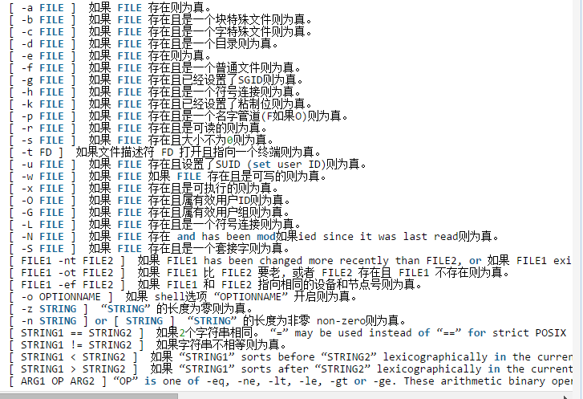

# shell脚本例子积累

### 1.shell例子积累
```
磁盘监测
df -h | awk '{if(NF==5) print $1,$4;if(NF==6) print $2,$5}'


#获取行号
b=`grep -n ^HISTSIZE profile | awk -F":" '{print $1}'`
#替换整行
sed -i "${b}c HISTSIZE=${a}" /etc/profile

获取某个字符串出现的总次数
grep -o 'a' ufile |wc -l
找出字符串出现的总行号
line=`sed -n '/'"$uname"'/=' $myfile`
找出某个字符串第一次出现的行数
line=`sed -n '/'ssh_allow'/=' $securfile | head -1`
在第三行后添加789
（使用变量的形式）sed -i "$line a ssh_allow ${a}" $securfile
sed -i '3 a 789'  test.txt

删除一行，不留空格
sed -i ''$line'd' $hostfile
删除所有的dddd行
sed -i '/dddd/d' /etc/cron.allow

我的文件路径
securfile="/home/zhang/project/shellproject/securfile"
crfile="/etc/cron.allow"

if好几个的时候
if [ $? -eq 0 ] && [ $a -eq 1 ] && [ $b -eq 1 ]


shell脚本获取最后一行
5 #!/bin/bash
  6 contral="$"                                                                                                                            
  7 num=$#
  8 eval echo $contral$num

替换前面带空格的wang
sed -i "/^\s*xiao/c wang" test.txt
匹配前面的空格
grep "[[:space:]]\{1,\}atchk" security_strategy
```

### 2.对文件相关的判断


