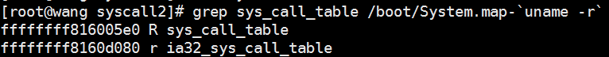
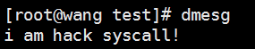

# linux添加系统调用
### 1.系统调用的基本原理
#### 1.1.系统调用的基本原理
系统调用其实就是函数调用，只不过调用的是内核态的函数，但是我们知道，用户态是不能随意调用内核态的函数的，所以采用软中断的方式从用户态陷入到内核态。在内核中通过软中断0X80，系统会跳转到一个预设好的内核空间地址，它指向了系统调用处理程序（**不要和系统调用服务例程混淆**），这里指的是在entry.S文件中的system_call函数。就是说，所有的系统调用都会统一跳转到这个地址执行system_call函数，那么system_call函数如何派发它们到各自的服务例程呢？
我们知道每个系统调用都有一个系统调用号。同时，内核中一个有一个system_call_table数组，它是个函数指针数组，每个函数指针都指向了系统调用的服务例程。这个系统调用号是system_call_table的下标，用来指明到底要执行哪个系统调用。当int ox80的软中断执行时，系统调用号会被放进eax寄存器中，system_call函数可以读取eax寄存器获得系统调用号，将其乘以4得到偏移地址，以sys_call_table为基地址，基地址加上偏移地址就是应该执行的系统调用服务例程的地址。
#### 1.2.关于系统调用的传参问题
当一个系统调用的参数个数大于5时（因为5个寄存器（eax, ebx, ecx, edx,esi）已经用完了），执行int 0x80指令时仍需将系统调用功能号保存在寄存器eax中，所不同的只是全部参数应该依次放在一块连续的内存区域里，同时在寄存器ebx中保存指向该内存区域的指针。系统调用完成之后，返回值扔将保存在寄存器eax中。由于只是需要一块连续的内存区域来保存系统调用的参数，因此完全可以像普通函数调用一样使用栈（stack）来传递系统调用所需要的参数。但是要注意一点，Linux采用的是c语言的调用模式，这就意味着所有参数必须以相反的顺序进栈，即最后一个参数先入栈，而第一个参数则最后入栈。如果采用栈来传递系统调用所需要的参数，在执行int 0x80指令时还应该将栈指针的当前值复制到寄存器ebx中。
### 2.添加系统调用的两种方法
**方法一：编译内核法**
拿到源码之后
> * 修改内核的系统调用库函数 ```/usr/include/asm-generic/unistd.h```，在这里面可以使用在syscall_table中没有用到的223号
> * 添加系统调用号，让系统根据这个号，去找到syscall_table中的相应表项。在``` /arch/x86/kernel/syscall_table_32.s```文件中添加系统调用号和调用函数的对应关系
> * 接着就是my_syscall的实现了，在这里有两种方法：第一种方法是在kernel下自己新建一个目录添加自己的文件，但是要编写Makefile，而且要修改全局的Makefile。第二种比较简便的方法是，在kernel/sys.c中添加自己的服务函数，这样子不用修改Makefile.

以上准备工作做完之后，然后就要进行编译内核了，以下是我编译内核的一个过程。
```
1.make menuconfig (使用图形化的工具，更新.config文件)
2.make -j3 （编译，-j3指的是同时使用3个cpu来编译）
3.make modules   （对模块进行编译）
4.make modules_install（安装编译好的模块）
5.depmod  （进行依赖关系的处理）
6.reboot  （重启看到自己编译好的内核）
```
**方法二：内核模块法**
这种方法是采用系统调用拦截的一种方式，改变某一个系统调用号对应的服务程序为我们自己的编写的程序，从而相当于添加了我们自己的系统调用。具体实现，我们来看下：
### 3.通过内核模块实现添加系统调用
这种方法其实是系统调用拦截的实现。系统调用服务程序的地址是放在sys_call_table中通过系统调用号定位到具体的系统调用地址，那么我们通过编写内核模块来修改sys_call_table中的系统调用的地址为我们自己定义的函数的地址，就可以实现系统调用的拦截。
想法有了：那就是通过模块加载时，将系统调用表里面的那个系统调用号的那个系统调用号对应的系统调用服务例程改为我们自己实现的系统历程函数地址。但是内核已经不知道从哪个版本就不支持导出sys_call_table了。所以首先要获取sys_call_table的地址。
网上介绍了好多种方法来得到sys_call_table的地址，这里介绍最简单的一种方法
```
grep sys_call_table /boot/System.map-`uname -r`
```



这样就得到了sys_call_table的地址，但同时也得到了一个重要的信息，该符号对应的内存区域是只读的。所以我们要修改它，必须对它进行清楚写保护，这里介绍两种方法：
**第一种方法：**：我们知道控制寄存器cr0的第16位是写保护位。cr0的第16位置为了禁止超级权限，若清零了则允许超级权限往内核中写入数据，这样我们可以再写入之前，将那一位清零，使我们可以写入。然后写完后，又将那一位复原就行了。
```
unsigned int clear_and_return_cr0(void)
{
 unsigned int cr0 = 0;
 unsigned int ret;
 asm("movl %%cr0, %%eax":"=a"(cr0));
 ret = cr0;
 cr0 &= 0xfffeffff;
 asm("movl %%eax, %%cr0"::"a"(cr0));
 return ret;
}

void setback_cr0(unsigned int val) //读取val的值到eax寄存器，再将eax寄存器的值放入cr0中
{
 asm volatile("movl %%eax, %%cr0"::"a"(val));
}


```
**第二种方法：**通过设置虚拟地址对应的也表项的读写属性来设置：
```
int make_rw(unsigned long address)
{
        unsigned int level;
        pte_t *pte = lookup_address(address, &level);//查找虚拟地址所在的页表地址
        if (pte->pte & ~_PAGE_RW)  //设置页表读写属性
                pte->pte |=  _PAGE_RW;

        return 0;
}


int make_ro(unsigned long address)
{
        unsigned int level;
        pte_t *pte = lookup_address(address, &level);
        pte->pte &= ~_PAGE_RW;  //设置只读属性

        return 0;
}

```
### 4.编写系统调用指定自己的系统调用
**内核的初始化函数**
在这里我使用系统空闲的223号空闲的系统调用号，你也可以换成其他系统调用的调用号，这样你在执行其他函数时，就会调用自己的写的函数的内容。
```
static int syscall_init_module(void)
{
        printk(KERN_ALERT "sys_call_table: 0x%p\n", sys_call_table);//获取系统调用表的地址
        orig_saved = (unsigned long *)(sys_call_table[223]);  //保存原有的223号的系统调用表的地址
        printk(KERN_ALERT "orig_saved : 0x%p\n", orig_saved );

        make_rw((unsigned long)sys_call_table);  //修改页的写属性
        sys_call_table[223] = (unsigned long *)sys_mycall;  //将223号指向自己写的调用函数
        make_ro((unsigned long)sys_call_table);

        return 0;
}
```
**自己的系统调用服务例程**
```
asmlinkage long sys_mycall(void)
{
    printk(KERN_ALERT "i am hack syscall!\n");
    return 0;
}
```
**移除内核模块时，将原有的系统调用进行还原**
```
static void syscall_cleanup_module(void)
{
        printk(KERN_ALERT "Module syscall unloaded.\n");

        make_rw((unsigned long)sys_call_table);
        sys_call_table[223] = (unsigned long *) orig_saved ;
        make_ro((unsigned long)sys_call_table);
}
```
**模块注册相关**
```
module_init(syscall_init_module);
module_exit(syscall_cleanup_module);

MODULE_LICENSE("GPL");
MODULE_DESCRIPTION("mysyscall");
```
### 5.编写用户态的测试程序
```
  1 #include <linux/unistd.h>
  2 #include <syscall.h>
  3 #include <sys/types.h>
  4 #include <stdio.h>
  5
  6 int main(void)
  7 {
  8     long pid = 0;
  9     pid = syscall(223);
 10     printf("%ld\n",pid);
 11     return 0;
 12 }

```
当我们使用syscall()这个函数去触发223的系统调用时，dmesg会发现我们自己写的服务函数的输出结果:

