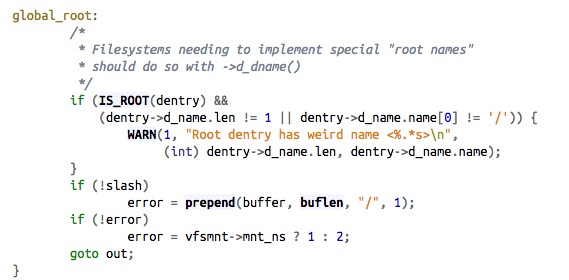

# kenel中路径的获取
在内核中获取文件的绝对路径至关重要，因为在内核开发中，会经常需要使用文件的绝对路径做判断依据。
在网上找到的一些获取绝对路径的方法，都存在一些缺陷：
###第一种：
```
char * get_file_absolute_path(const char *filename)
{
	struct path pwd;
	char *ab_path = kmalloc(ABSOLUTE_PATH_LENGTH * sizeof(char), GFP_KERNEL);
	char *path = kmalloc(ABSOLUTE_PATH_LENGTH * sizeof(char), GFP_KERNEL);
	char *ppath = path;
	char *cwd = NULL;

	memset(ab_path, 0, ABSOLUTE_PATH_LENGTH);
	memset(path, 0, ABSOLUTE_PATH_LENGTH);
	pwd = current->fs->pwd;
	path_get(&pwd);
 	cwd = d_path(&pwd, ppath, ABSOLUTE_PATH_LENGTH);
	strcpy(ab_path, cwd);

	strcat(ab_path, filename);

	if(path != NULL)
	{
		kfree(path);
	}

	return ab_path;
}
```
这种方法看似靠谱，但是当你以绝对路径进行访问文件时，就会发现文件路径输出是错误的，原因就是因为这种方法使用了pwd。
###在内核中提供了一个获取绝对路径的方法：
```
char *dentry_path_raw(struct dentry *dentry, char *buf, int buflen)
{
	return __dentry_path(dentry, buf, buflen);
}
EXPORT_SYMBOL(dentry_path_raw);
```
这是内核中导出的一个函数，看来是内核开发出来给我们使用的，但是在测试时，发现当你访问的文件是在一个挂载点下面时，获取到的绝对路径会丢失挂载点前面的内容。（亲测），所以这也是一种不是很全面的方法。
###第三种（比较完善的方法）

内核中提供了一种比较完善的方法，可以解决上面提到的两个问题，但是这个函数是没有导出的，所以需要使用比较hack的方法，使用kallsyms_lookup_name动态获取地址，再赋值给一个函数指针，然后使用。

```
char *d_absolute_path(const struct path *path,
	       char *buf, int buflen)
{
	struct path root = {};
	char *res = buf + buflen;
	int error;

	prepend(&res, &buflen, "\0", 1);
	error = prepend_path(path, &root, &res, &buflen);

	if (error > 1)
		error = -EINVAL;
	if (error < 0)
		return ERR_PTR(error);
	return res;
}
```
**还有一个需要注意的是，d_absolute_path这个函数中会调用prepend_path，这个函数再低版本的内核中貌似有Bug,会不断的出现warining**



所以对于这种情况要特殊处理：
```
if ((IS_ROOT(path->dentry) && (path->dentry->d_name.len != 1 || path->dentry->d_name.name[0] != '/')))
{

	//自己处理
}
```
