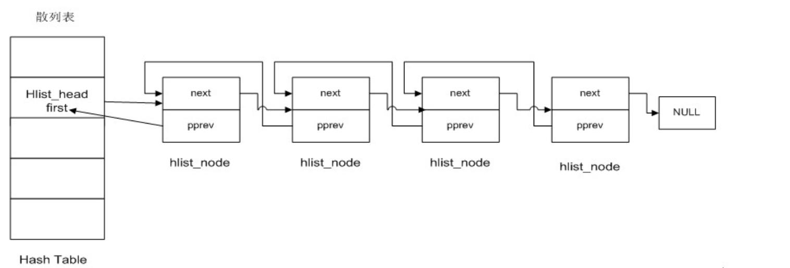

# linux内核hashtable
参考链接：
```
https://kernelnewbies.org/FAQ/Hashtables
http://yupeng0921.blogspot.hk/2010/10/linux-hash-table.html?showComment=1350877062473#c3513363701255844366
```
最新版本的内核hashtable在#include <linux/hashtable.h>这个函数中，哈希表的实现如下图：


### 1.如何定义一个hashtable
```
15 #define DEFINE_HASHTABLE(name, bits)                                            \
16         struct hlist_head name[1 << (bits)] =                                   \
17                         { [0 ... ((1 << (bits)) - 1)] = HLIST_HEAD_INIT }
```
Notice that we use the number of bits to define a hashtable and not the size, so the following declaration will have 8 buckets.
```
DEFINE_HASHTABLE(a, 3);
```
### 2.添加一个node，使用的API是：
```
hash_add(a, &first.next, first.data);
```
### 3.遍历一个hashtable的API:
```
hash_for_each_safe
```

### 4.完整的demo
```
#include <linux/init.h>
#include <linux/module.h>
#include <linux/list.h>
#include <linux/slab.h>
#include <linux/hashtable.h>
#include <linux/jhash.h>
#include <linux/types.h>
typedef struct student
{
	int number;
    char buf[30];
}student_t;

typedef struct students_list
{
	int count;                       
	student_t rules[];
}students_list_t;

typedef struct student_rule {
    struct hlist_node node;
    uint32_t index;
    student_t rule;
}student_rule_t;

#define for_each_rule(rules_list, rule) \
    for ((rule) = (rules_list)->rules; (rule) - (rules_list)->rules < (rules_list)->count; (rule)++)

#define current_rule_index(rules_list, rule)    ((rule) - (rules_list)->rules)

#define DEFAULT_RULE_HASH_BUCKET_BITS   17

//初始化hash_head
static DEFINE_HASHTABLE(student_active_rules, DEFAULT_RULE_HASH_BUCKET_BITS);

#define jhash_string(str) jhash((str), strlen(str), 0x95279527)

void PrintfArray(student_t *p, int num)
{
    int i = 0;
    for(i=0; i<num; i++)
    {
        printk("%d========%d\n",i, p[i].number);
    }
}

//遍历hashtable
static void test_for_each_hash_table(void)
{

    int bkt;
    student_rule_t *rule;
    struct hlist_node *tmp;

    if(hash_empty(student_active_rules)){
            printk("hash table is empty========================\n");
    }

    printk("from hash table========================\n");
    hash_for_each_safe(student_active_rules, bkt, tmp, rule, node) {
        int idx = rule->index;
        printk("hashtable===index:%d\n", idx);
        printk("hashtable===index:%s\n", rule->rule.buf);
    }
    printk("end hash table========================\n");
}


static void build_hash_table(students_list_t *rules)
{
    const student_t *rule;
    for_each_rule(rules, rule){
        student_rule_t *entry = (student_rule_t*)kmalloc(sizeof(student_rule_t), GFP_ATOMIC);
        if(!entry){
            printk("kmalloc error in build_hash_table\n");
        }
        memcpy(&entry->rule, rule, sizeof(*rule));
        entry->index = current_rule_index(rules, rule);
        hash_add(student_active_rules, &entry->node, jhash_string(rule->buf));
    }
    test_for_each_hash_table();
}

static int htest_init (void)
{
    int i = 0;
    student_t tArray[10];
    //student_t *temp;
    students_list_t *fs_list = (students_list_t *)kmalloc(sizeof(students_list_t)+10*sizeof(student_t), GFP_ATOMIC);

    for(i=0; i < 10; i++){
        tArray[i].number = i;
    }

    strcpy(tArray[0].buf, "123");
    strcpy(tArray[1].buf, "1234");
    strcpy(tArray[2].buf, "1235");
    strcpy(tArray[3].buf, "1236");
    strcpy(tArray[4].buf, "1237");
    strcpy(tArray[5].buf, "1238");
    strcpy(tArray[6].buf, "1239");
    strcpy(tArray[7].buf, "12310");
    strcpy(tArray[8].buf, "1212310");
    strcpy(tArray[9].buf, "3412310");

    if(fs_list != NULL)
    {
        fs_list->count = 10;
        //结构体数组拷贝
        memcpy(fs_list->rules, tArray, 10*sizeof(student_t));    
    }

    //测试是否正确
    // for(i=0; i < 10; i++)
    // {
    //     temp = ((fs_list->rules)+i);
    //     printk("%s\n",temp->buf);
    // }

    build_hash_table(fs_list);
    return 0;
}

static void htest_exit (void)
{
}

module_init(htest_init);
module_exit(htest_exit);

MODULE_LICENSE("GPL");
```
