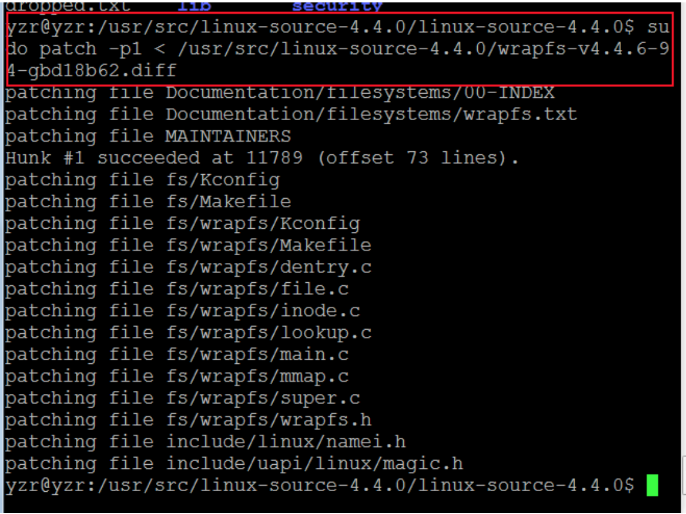

# 获取wrapfs源码

#1.下载源码包
```
sudo apt-get install linux-source-4.4.0
```
#2.解压源码
```
sudo tar -xjf linux-source-4.4.0.tar.bz2
```
#3.下载wrapfs的补丁
```
http://download.filesystems.org/wrapfs/patches/
```
#4.打补丁（注意路径）

